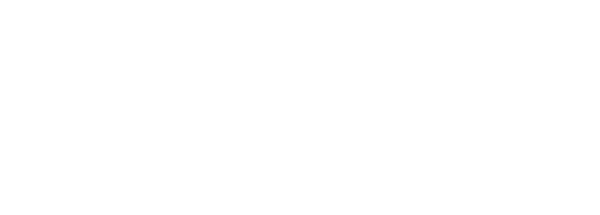

# Nike Email Dark Mode Test

A test project exploring dark mode implementation for HTML emails, specifically focusing on swapping logo colors (black ↔ white Nike Swoosh) based on email client dark mode settings.

## Live Demo

https://sdasse.github.io/nike-email-test/test.html

## What Works

### Final Implementation: PNG Image Swap

The production solution uses two PNG images with CSS media queries and inline styles:

- **Black Swoosh** (swoosh-black.png) - Shows by default
- **White Swoosh** (swoosh-white.png) - Swaps in for dark mode
- CSS `@media (prefers-color-scheme: dark)` for modern clients
- `div[data-ogsc]` selector for Outlook.com/Android
- Inline styles: `transition: none !important; background-color: transparent !important;` to prevent hover effects

### Email Client Support

| Client | Support | Notes |
|--------|---------|-------|
| **Apple Mail** (macOS) | ✅ Full | Dark mode switching works perfectly |
| **iOS Mail** | ✅ Full | Dark mode switching works perfectly |
| **Outlook Mac** | ✅ Full | Dark mode switching works perfectly |
| **Outlook.com** (Web) | ✅ Full | Works with `div[data-ogsc]` selector + wrapper div with color style |
| **Gmail Desktop** (Web) | ✅ Full | Dark mode switching works perfectly |
| **Gmail Mobile** (iOS/Android) | ⚠️ Partial | Shows black Swoosh only (no dark mode switching) |
| **Outlook Windows** | ⚠️ Partial | Shows black Swoosh only (no modern CSS support) |
| **Forwarded emails** | ⚠️ Limited | Gmail strips some inline styles during forwarding, may show hover effects |

## Key Learnings

### 1. Inline SVG is Not Viable
- **Outlook.com strips inline SVG** for security reasons (recently retired support)
- Many older clients have no SVG support
- Gmail inconsistently supports inline SVG
- **Recommendation:** Use PNG/JPG images, not inline SVG

### 2. Outlook.com Dark Mode Requires Special Handling
- The documented `[data-ogsc]` selector alone doesn't work
- Must wrap images in a `<div>` with a color style (e.g., `style="color: #000000;"`)
- Outlook adds `data-ogsc` attribute when it converts the color in dark mode
- Then you can target with `div[data-ogsc] .your-class`

### 3. Show Light Image by Default (Don't Hide Both)
- Early attempts hid both images and showed them conditionally - this failed
- **Correct pattern:** Light image visible by default, dark image hidden with `display: none`
- Ensures fallback always works even if CSS is stripped

### 4. Gmail Strips CSS During Forwarding
- When emails are forwarded through Gmail, many inline styles are removed
- Properties like `transition`, `background-color`, and others are filtered out
- This is unavoidable - accept this as an edge case limitation

### 5. Outlook.com Adds Hover Effects on Images
- Outlook.com's UI adds a white tint (`rgba(255,255,255,0.1)`) on image hover
- Fixed with: `transition: none !important; background-color: transparent !important;`
- However, Gmail strips these styles during forwarding (see #4)

### 6. Linear Gradient Hack (Mostly Ineffective)
- Annett Forcier's technique: `background-image: linear-gradient(#000, #000)` prevents color inversion
- Outlook.com stripped this from wrapper divs
- May work in other contexts, but not effective for this use case

### 7. CSS Blend Modes (Not Pursued)
- Rémi Parmentier's blend mode technique targets Gmail iOS specifically
- Designed for text/background colors, not ideal for images
- Would add complexity for marginal gains
- Better to accept black Swoosh fallback in Gmail mobile apps

## Code Structure

### Meta Tags
```html
<meta name="color-scheme" content="light dark">
<meta name="supported-color-schemes" content="light dark">
```
Enables dark mode detection in supporting clients.

### CSS Media Queries
```css
@media (prefers-color-scheme: dark) {
    .light-img { display: none !important; }
    .dark-img { display: block !important; }
}
```
Handles Apple Mail, iOS Mail, Outlook Mac.

### Outlook.com Targeting
```css
div[data-ogsc] .light-img { display: none !important; }
div[data-ogsc] .dark-img { display: block !important; }
```
Targets elements after Outlook adds the `data-ogsc` attribute.

### HTML Pattern
```html
<div style="color: #000000;">
    

    <!--[if !mso]><!-->
    <div style="display: inline-block;">
        
    </div>
    <!--<![endif]-->
</div>
```

## Resources

- [Litmus: The Ultimate Guide to Dark Mode for Email Marketers](https://www.litmus.com/blog/the-ultimate-guide-to-dark-mode-for-email-marketers)
- [HTeuMeuLeu: Fixing Gmail's Dark Mode Issues with CSS Blend Modes](https://www.hteumeuleu.com/2021/fixing-gmail-dark-mode-css-blend-modes/)
- [HowToTarget.email](https://howtotarget.email/) - Email client targeting techniques

## Best Practices Summary

1. ✅ Use PNG/JPG images with swap technique
2. ✅ Show light image by default (fallback)
3. ✅ Hide dark image with inline `display: none` + CSS
4. ✅ Use both `@media (prefers-color-scheme)` and `[data-ogsc]` selectors
5. ✅ Wrap in div with color style to trigger Outlook's data-ogsc
6. ✅ Add hover prevention: `transition: none` and `background-color: transparent`
7. ✅ Use conditional comments `<!--[if !mso]>` to hide dark image from Outlook Windows
8. ❌ Don't use inline SVG
9. ❌ Don't hide both images by default
10. ❌ Don't rely on complex CSS that will be stripped

## Files

- `test.html` - Production-ready dark mode email test
- `swoosh-black.png` - Black Nike Swoosh (600x215px)
- `swoosh-white.png` - White Nike Swoosh (600x215px)

## License

This is a test/learning project. Nike Swoosh is a trademark of Nike, Inc.
